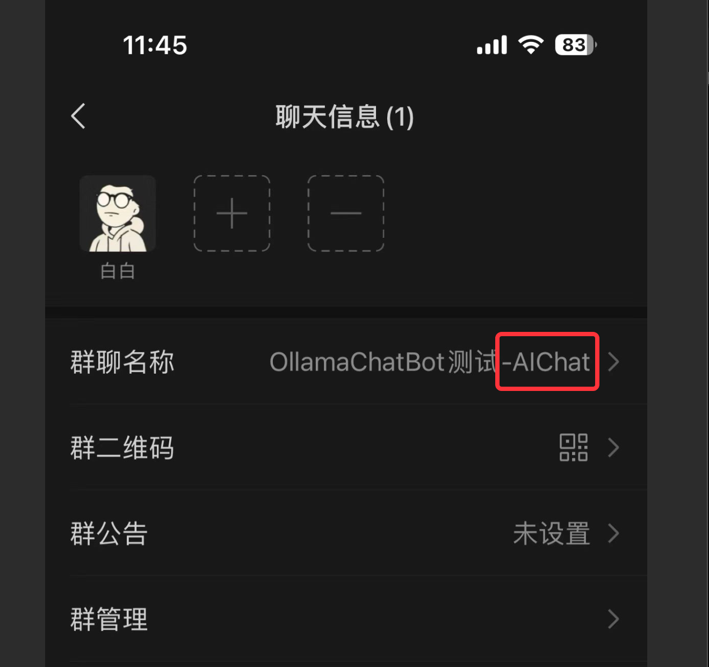

# Ollama Chat Bot
> 本地大模型的聊天机器人

## 介绍
本项目展示一个简单易用的本地大模型聊天机器人，基于[Ollama](https://github.com/ollama/ollama)开发

## 为什么没有直接用Ollama服务
Ollama已经做的足够好了，但对小白来说还不够简单。 先要Ollama以服务形式启动，然后再启动应用层调用Ollama的接口。
这对于一些小白来说还是有一定的门槛。所以本项目是把Ollama以库形式直接嵌入应用层，一键启动，无需其他关联服务。

## 特性
- 完全本地运行大模型推理，不需要其他llm api
- 支持多种模型，包括qewn、llama2、gemma、mixtral等(具体模型请访问[Ollama Library](https://ollama.com/library))
- 一键启动，无需其他关联服务

## 架构图


## 微信聊天机器人使用
1. 下载可执行程序
2. 启动服务(如果模型不存在会自动下载模型)
3. 扫码登陆(模型加载完自动弹出浏览器扫码页面)
4. 建立个群，群后名字后面加上 -AIChat

5. 群内有人说话，机器人会已你的身份自动回复


## 飞书机器人使用
使用方式类似，需要在config.yaml里配置[飞书app](https://open.feishu.cn/app)的app_id和app_secret等

## 编译
go
```bash
make build
```